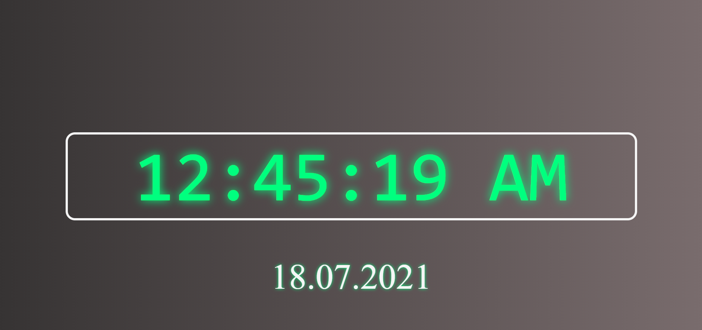
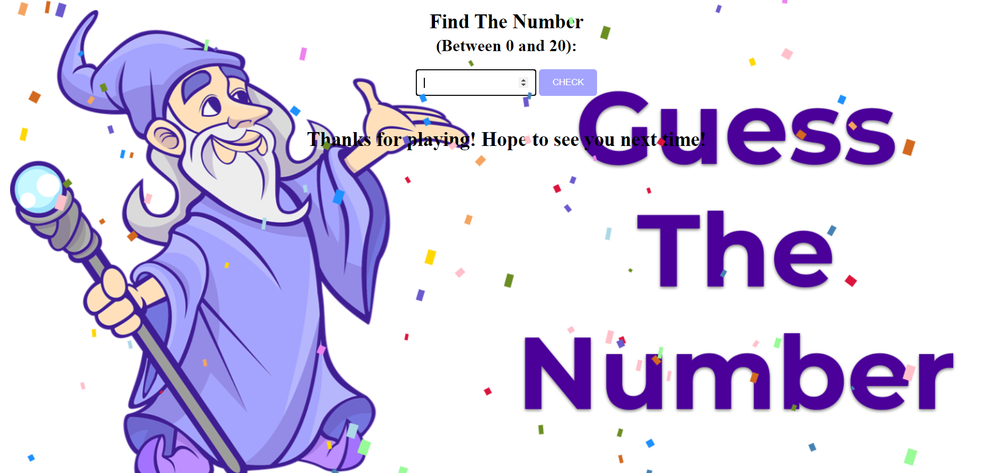

 
  
<h1 align="center">Index of Javascript Projects</h1>

<table>
    <thead>
        <tr>
            <td>Project Name</td>
            <td>Repo Link</td>
            <td>App Link</td>
            <td>Overview</td>
        </tr>
    </thead>
    <tbody>
        <tr>
            <td>Visual Digital Clock</td>
            <td><a href="https://github.com/furkan-cloud/visual-clock" target="_blank">Repo details</a></td>
            <td><a href="https://furkan-cloud.github.io/visual-clock/" target="_blank">Click here to see the project</a></td>
            <td></td> 
        </tr>
                <tr>
            <td>Guess The Number</td>
            <td><a href="https://github.com/furkan-cloud/005-Find-the-number" target="_blank">Repo details</a></td>
            <td><a href="https://furkan-cloud.github.io/005-Find-the-number/" target="_blank">Click here to see the project</a></td>
            <td></td> 
        </tr>
                        <tr>
            <td>Reverse Words</td>
            <td><a href="https://github.com/furkan-cloud/Reverse-Words" target="_blank">Repo details</a></td>
            <td><a href="https://furkan-cloud.github.io/Reverse-Words/" target="_blank">Click here to see the project</a></td>
            <td></td> 
        </tr>
                                <tr>
            <td>Perfect Number</td>
            <td><a href="https://github.com/furkan-cloud/Perfect-Number" target="_blank">Repo details</a></td>
            <td><a href="https://furkan-cloud.github.io/Perfect-Number/" target="_blank">Click here to see the project</a></td>
            <td></td> 
        </tr>
                                        <tr>
            <td>Color Changer</td>
            <td><a href="https://github.com/furkan-cloud/Color-changer" target="_blank">Repo details</a></td>
            <td><a href="https://furkan-cloud.github.io/Color-changer/" target="_blank">Click here to see the project</a></td>
            <td></td> 
        </tr>
                                                <tr>
            <td>Color Changer</td>
            <td><a href="https://github.com/furkan-cloud/light-bulb-on-off" target="_blank">Repo details</a></td>
            <td><a href="https://furkan-cloud.github.io/light-bulb-on-off/" target="_blank">Click here to see the project</a></td>
            <td></td> 
        </tr>
</tbody>
</table>
